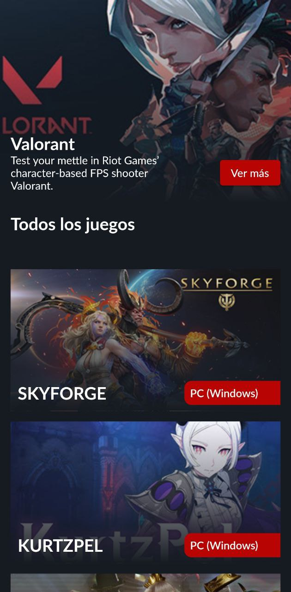
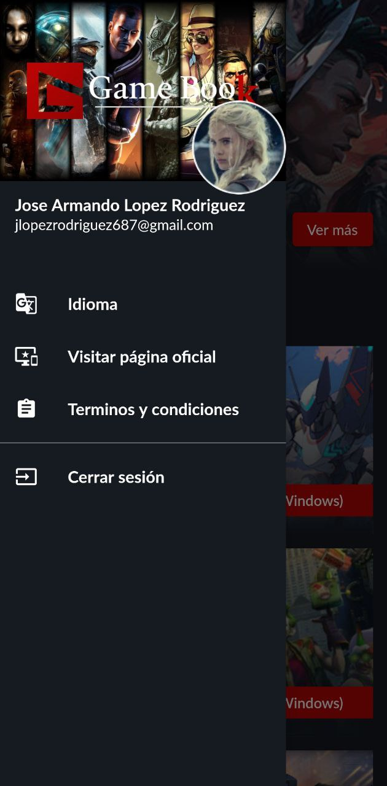
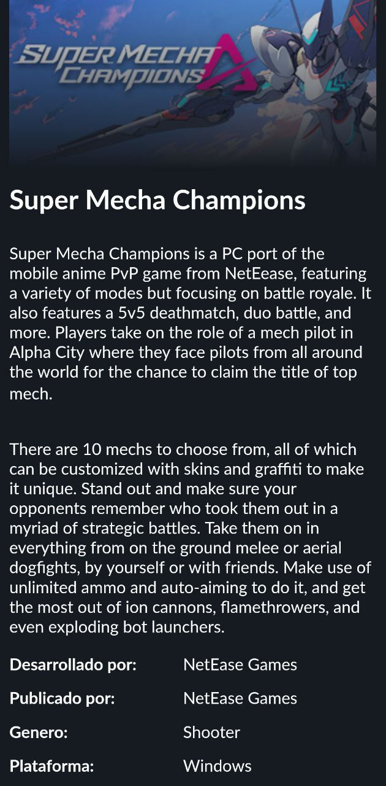

# gamebook

Proyecto demo, aplicación de demostración funcional de curso de aprendizaje con Flutter

## Guía de inicio 

This project is a starting point for a Flutter application.

A few resources to get you started if this is your first Flutter project:

- [Lab: Write your first Flutter app](https://flutter.dev/docs/get-started/codelab)
- [Cookbook: Useful Flutter samples](https://flutter.dev/docs/cookbook)

For help getting started with Flutter, view our
[online documentation](https://flutter.dev/docs), which offers tutorials,
samples, guidance on mobile development, and a full API reference.

## Para probar el proyecto debe seguir los siguientes pasos

- Tener el sdk de flutter instalado v2.10.x o superior
- Clonar el repositorio
- Descargar las dependencias
- Configurar un proyecto de Firebase y obtener una firma de autorización ```google-services.json``` y remplazar el archivo en el directorio de android
- Generar un archivo de configuración ```key.properties``` con los datos correcpondientes a su firma y su llave de configuracion 
- Finalmente hacer correr el proyecto con un editor de código o atraves de linea de comando con ```flutter run```
- Para obtener un archivo compilado en android .apk usar ```flutter build apk```
- Para obtener un archivo compilado en android para despliegue utilizar usar ```flutter build appbundle```
- Para obtener un archivo compilado en ios  usar ```flutter build ios```
- Para obtener un archivo compilado en ios para despliegue  usar ```flutter build ipa```

## Para genererar una firma siga los siguientes pasos

- comando para generar un firma conel keytool de su jre de JAVA

```
    /usr/local/android-studio/jre/bin/keytool -genkey -v -keystore ~/app-gamebook.jks -keyalg RSA -keysize 2048 -validity 10000 -alias appgamebook
```

- (opcional) si decea migrar a tipo de firma PKCS12 ejecute el siguiente comando
```
    /usr/local/android-studio/jre/bin/keytool -importkeystore -srckeystore /home/jose/app-gamebook.jks -destkeystore /home/jose/app-gamebook.jks -deststoretype pkcs12
```

- comando para ver la información de la firma (necesita usar la contraceña con la que configuro su llave)

```
/usr/local/android-studio/jre/bin/keytool -list -v -alias appgamebook -keystore ~/app-gamebook.jks
```

##### Para mas información consulte la documentacion oficial de Flutter 
- [Configuración para release en Android](https://docs.flutter.dev/deployment/android)
- [Configuración para release en IOS](https://docs.flutter.dev/deployment/ios)

##### Capturas de pantalla del proyecto



![login](assets/img/demo-screen/photo_2022-10-05_16-45-04.jpg

